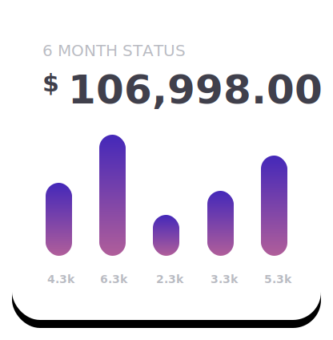

# workingWithGit
SAIT Github project

# DON'T FORGET TO DOWNLOAD THE SVG'S

# IF YOU NEED ANY HELP PLEASE CALL OR TEXT ME, DEIGAN MILLIKIN 403-404-9733

## HEADER CODE

<!DOCTYPE html>
<html lang="en">
  
<head>
  <meta charset="UTF-8">
  <meta name="viewport" content="width=device-width, initial-scale=1.0">
  <meta http-equiv="X-UA-Compatible" content="ie=edge">
  <link rel="stylesheet" href="services.css">
  <title>Document</title>
</head>

<body>

  <header>

    

      <nav>
        
        <ul class="main-nav">
          <li><a href="#">Home</a></li>
          <li><a href="#">About</a href="#"></li>
          <li><a href="#">Services</a href="#"></li>
        </ul>
      </nav>

      <!-- CHANGE THIS PART TO WHATEVER IS ON YOUR PAGE -->
      

        <h1>PRODUCTS</h1>
        <h2>Choose  your product</h2>
        
A complete solution to track all the expenses bared by your pocket and manage your personal finance.

      

      

        
        
      

    

  </header>

</body>
</html>

 /****** FONTS ******/
 
 @import url('https://fonts.googleapis.com/css?family=Open+Sans&display=swap');

/****** RESETS ******/

* {
  box-sizing: border-box;
  list-style: none;
  text-decoration: none;
}

body {
  margin: 0;
  padding: 0;
  /****** I've set the font here, feel free to move it if you want  ******/
  font-family: 'Open Sans', sans-serif;
}

/****** HEADER ******/

 header {
   background: linear-gradient(135deg,#4B2BB7 35%, #FA6797) ;
   height: 70vh;
   width: 100vw;
 }

 .header-wrapper {
   width: 80%;
   margin: 0 auto;
 }

/****** TOP NAVIGATION ******/

 nav {
  display: flex;
  justify-content: space-between;
  padding-top: 20px;
 }

 .main-nav {
   margin: none;
   display: flex;
 }

 .main-nav a {
   color: white;
   padding-left: 3rem;
 }

/****** YOUR TEXT ON THE HEADER ******/

 .intro {
   display: grid;
   width: 47%;
   grid-template-columns: 1fr;
   grid-template-rows: auto, auto, auto;
   gap: 1rem;
   float: left;
   margin-top: 55px;
 }

 .intro h1 {
  grid-column: 1 / 2;
  grid-row: 1 / 2;
  color: #FA6797;
  margin: auto 0;
 }

 .intro h2 {
  grid-column: 1 / 2;
  grid-row: 2 / 3;
  font-size: 2.625rem;
  font-weight: 700;
  color: #FFF;
  line-height: 2.625rem;
  margin: auto 0;
 }

 .intro p {
  grid-column: 1;
  grid-row: 3;
  color: white;
  margin: auto 0;
  font-size: 1.2rem;
 }

/****** GRAPH CARDS THAT ARE OVERLAPING ******/

 .cards {
  display: grid;
  grid-template-columns:  90px 90px;
  grid-template-rows: 50px 50px;
  margin-top: 80px;
  padding-left: 100px;
 }

 .three-months {
   grid-column: 1 / 2;
   grid-row: 2 / 3;
 }

 .six-months {
  grid-column: 2 / 3;
  grid-row: 1 / 2;
}

 .six-months,
 .three-months {
   height: 250px;
 } 
 
  /********************************** END OF HEADER **********************************************/